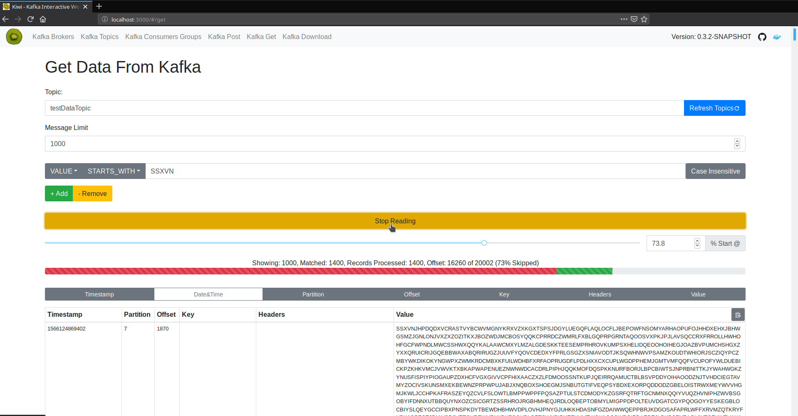

# KIWI - Kafka Interactive Web Interface 

[](https://opensource.org/licenses/Apache-2.0)
[]()

A Kafka Web Interface, written to help my professional day to day role working with kafka, but provided here in the event anyone else may benefit from using it.

#### What this tool attempts to provide
 - API versions of console scripts provided in kafka installs bin dir
 - Support for kafka headers
 - Live streaming of data with filters
  

#### What this tool is
 - Project is a springboot app using reactjs frontend.
 - Project has been development against kafka >2.0.0. 
  
## Overview

In general the target is to replicate many of the features of provided by the scripts which are included with the kafka server. 
Such as kafka-console-consumer.sh, kafka-consumer-groups.sh

- Example Screenshots: 





## Getting Started

#### Running via Docker
`docker run -p 8080:8080 -e KAFKA_BASE_CLIENT_BOOTSTRAPSERVERS=kafka.ip.preprod1.myorg.com:9092 dmwood/kiwi:latest`

- To connect to a locally running kafka you can do something like this:

`docker run --network="host" -e KAFKA_BASE_CLIENT_BOOTSTRAPSERVERS=localhost:9092 dmwood/kiwi:latest`
 
#### Run jar

 - Download jar from releases page
 
`java -jar -Dkafka.base.client.bootstrapServers=localhost:9092 target/kiwi-$version.jar`
 
#### Build & Run Jar

Dependencies: 
 - Requires Java 8 or higher 
 - Requires Node 8 or higher
 - Requires Maven 3 or higher
 
Build:
 - Run `mvn clean install`
Run: 
 - Run `mvn -Dkafka.base.client.bootstrapServers=localhost:9092 spring-boot:run` (You will need to have run the web build step before for the website to be hosted)
 - or Jar runnable via `java -jar -Dkafka.base.client.bootstrapServers=localhost:9092 target/kiwi-$version.jar`
  
#### Development - Getting Started

There are various ways this can be started locally, this is my preferred method:

 - Run `./run-docker.sh`
 - Start KiwiApplication or via `mvn spring-boot:run`
 - Run `./run-node-server.sh`
 - Go to `localhost:3000` to see UI
 
Editing should javascript should lead to live updates of the UI at `localhost:3000`.
The UI will also be available at `localhost:8080` or whatever port you have set `server.port` to.
But this will not update automatically when making changes.
  

#### Current release process
 - `mvn clean release:prepare`
 - `mvn clean release:perform`
 - Manual upload jar, release draft
 - Docker image is pushed in the perform step, but I also potentially retag as latest and push that
 
## Configuration

#### Configuring Multiple Kafka clusters
 - The `docker-compose-multi-cluster.yml` is an example basic configuration for multiple kafka clusters

 - Properties can apply to all kafka client configuration:
```
kafka.base.client.bootstrapServers = localhost:9092
```
 - Properties can apply to all consumer/producer/admin configuration:
```
kafka.base.producer.acks = 0
kafka.base.consumer.maxPollRecords = 0
```
 - Properties can apply to the consumer/producer/admin configuration for one cluster, where the variable following `clusters` can be selected from a dropdown on the web client to switch between different kafka clusters 
```
kafka.clusters.default.producer.acks = 0
kafka.clusters.backup.maxPollRecords = 0
```
 
 - Note: Kafka properties are the final component of the configuration and should be added without dots or hyphens eg the below converts to `key.serializer=org.apache.kafka.common.serialization.StringSerializer` in the producer config
```
kafka.base.producer.keySerializer=org.apache.kafka.common.serialization.StringSerializer
```

#### Configuring SSL Kafka clusters

 - Example SSL configuration:
 
```
kafka.clusters.secure.client.bootstrapServers=localhost:9024,localhost:9025,localhost:9026
kafka.clusters.secure.client.securityProtocol=SSL
kafka.clusters.secure.client.sslTruststoreLocation=scripts/ssl/kafka.client.truststore.jks
kafka.clusters.secure.client.sslTruststorePassword=secret
kafka.clusters.secure.client.sslKeystoreLocation=scripts/ssl/kafka.client.truststore.jks
kafka.clusters.secure.client.sslKeystorePassword=secret
kafka.clusters.secure.client.sslEndpointIdentificationAlgorithm=none
```
 - See the docker-compose.yml in the scrips/ssl folder for an example of configuring kiwi to use ssl.